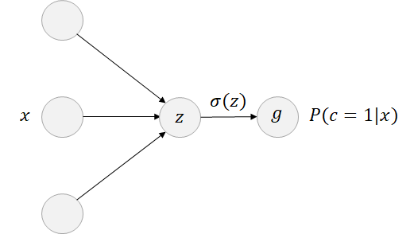
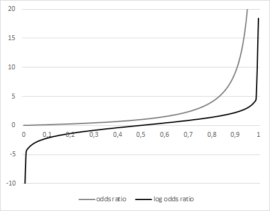
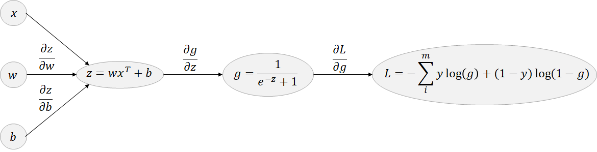
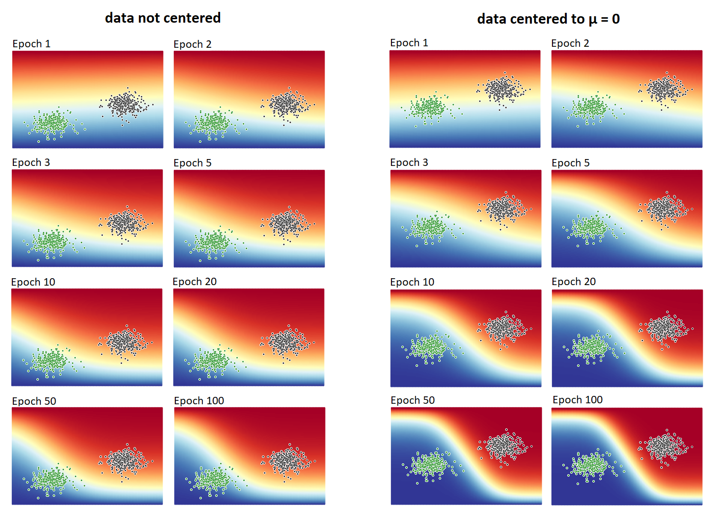

<h1>Neural Networks and Logistic Regression - Backpropagation in depth</h1>
<p align="left" style="font-size:13px;"><b>Christoph Winkler</b><br>
<i>M. Sc. Business Information Systems, Data Scientist.<br>
Generative Modeling is simply about modeling "How the world could be" and not necessarily "How the world actually is".</i></p>
<br>
Logistic regression is one of the most popular machine learning models for classification. Mathematically, logistic regression is a special case of a neural network and is therefore a reasonable introduction to learn how backpropagation in neural networks actually works. In this article the theoretical foundation for logistic regression is discussed. In particular, it is shown how to derive the equations for gradient descent and optimize model parameters. Furthermore, a Python implementation is presented and model convergence is analyzed based on a synthetic sample data set. This article is written for practitioners and researchers that have a basic understanding of neural networks, calculus and optimization.<br>

<h2>Model</h2>
In general, logistic regression is a classification model that learns to predict from a set of features x to which class a data point belongs. It is a linear and discriminative model. Binomial logistic regression learns the probability P(y = 1|x) which can be used as decision boundary to assign x to one of two classes. It is important to note that logistic regression can only predict probabilities and therefore can only be used for classification and not for regression. Similiar to neural networks logistic regression starts with multiple input nodes which represent the features of a data set. In contrast, logistic regression has no hidden layer and only a single output node with a sigmoid activation function. The sigmoid activation function is applied to transform any linear combination z = wx + b without any upper or lower bound, also known as log odds ratio or logit, into the probability value g that equals the probability that input x belongs to class zero or one. We compute log odds ratio by multiplying the weight tensor w that represents the connection between input features and output node by x and adding a bias term b. If z takes on a large activation for x, the probability for class one is also quite large.

<p align="center">

</p>

<h2>Deriving Sigmoid from Odds</h2>

Why is the sigmoid function required to transform the result of a linear function z = wx + b into probability values? Why do we not use regression to directly predict probabilities? The answer is that it is quite hard to predict probabilities directly. If the model is very confident about class one it might output a probability greater than one. But it is not possible to have probability values greater than one and the loss used in regression will penalize it. It turns out that the inability to model an upper or lower bound for the predicted variable in regression harms learning progress since the model is not allowed to be very confident about a certain class. Therefore it is easier to model odds ratio:

<p align="center">
<a href="https://www.codecogs.com/eqnedit.php?latex=\dpi{120}&space;odds&space;ratio=\frac{p}{1-p}" target="_blank"></a>
</p>

We all know odds from sports. The variable p equals the probability that an event will happen and the denominator is the probability that it will not happen. A great advantage of encoding odds is that odds ratio has no upper bound. Therefore, it better fits the model assumptions for regression. But it still has the lower bound zero. In order to remove the lower bound we apply a simple trick. We take the natural logarithm of odds ratio.

<p align="center">
<a href="https://www.codecogs.com/eqnedit.php?latex=\dpi{120}&space;log(odds&space;ratio)=log\left&space;(&space;\frac{p}{1-p}\right&space;)" target="_blank"></a>
</p>

<p align="center">

</p>

Log odds ratio or simply logit is the value we would like to predict using a linear model z = wx + b. Therefore, we have an equation:

<p align="center">
<a href="https://www.codecogs.com/eqnedit.php?latex=\dpi{120}&space;wx&space;&plus;&space;b=log\left&space;(&space;\frac{p}{1-p}\right&space;)" target="_blank"></a>
</p>

Then have to compute its inverse function to get p from log odds z:

<p align="center">
<a href="https://www.codecogs.com/eqnedit.php?latex=\dpi{120}&space;\newline&space;wx&space;&plus;&space;b=log\left&space;(&space;\frac{p}{1-p}\right&space;)&space;\newline&space;\newline&space;e^{wx&plus;b}=e^{log\left&space;(&space;\frac{p}{1-p}\right&space;)}=\frac{p}{1-p}&space;\newline&space;e^{wx&plus;b}(1-p)=e^{wx&plus;b}-e^{wx&plus;b}p=p&space;\newline&space;e^{wx&plus;b}=p&plus;e^{wx&plus;b}p=p(1&plus;e^{wx&plus;b})&space;\newline&space;p&space;=&space;\frac{e^{wx&plus;b}}{1&plus;e^{wx&plus;b}}&space;\newline&space;p&space;=&space;\frac{1}{1&plus;e^{wx&plus;b}}" target="_blank"></a>
</p>

The result is commonly known as sigmoid function.

<p align="center">
<a href="https://www.codecogs.com/eqnedit.php?latex=\dpi{120}&space;\newline&space;\sigma&space;(z)&space;=&space;\frac{1}{1&plus;e^{-z}}&space;\newline&space;\newline&space;z&space;=&space;wx&space;&plus;&space;b" target="_blank"></a>
</p>

It was shown how to derive sigmoid from odds and why it is better to predict logg odds ratio and not probability values directly. In the next section the loss used in logistic regression is discussed.

<h2>Loss and Optimization</h2>
The loss that is minimized during training is known as binary cross entropy. It decreases if the predicted probability for the class labels g get closer to the true class labels y and is therefore an appropriate measure to monitor the learning progress and convergence of the model (see illustration below). 
<p align="center">

</p>
In general, binary cross entropy is a measure of uncertantity. Since we know the true distribution p(y), but we don't know the function to distinguish between the two classes, we would like to learn the log odds ratio z of two classes based on x that has a distribution q(y) which approximates the true distribution p(y) as much as possible. This is how classification in neural networks and logistic regression actually works. The only difference between neural networks and logistic regression is that neural networks are able to model non linear relationships because of hidden layers which is not possible in a linear model like logistic regression. 
<br><br>
Now let's discuss the steps to make predictions and propagate back the error to adapt the model parameters w and b based on x and the loss L. First the training set x is passed through the model. The forward propagation step in logistic regression is composed of three steps.

<p align="center">
<a href="https://www.codecogs.com/eqnedit.php?latex=\dpi{120}&space;\newline&space;z&space;=&space;wx^{T}&space;&plus;&space;b&space;\newline&space;g&space;=&space;\sigma&space;(z)&space;=&space;\frac{1}{1&plus;e^{-z}}&space;\newline&space;L&space;=&space;-\sum_{i}^{m}&space;y\log(g)&space;&plus;&space;(1&space;-&space;y)\log(1-g)" target="_blank"></a>
</p>

As stated above we compute the outcome z of the linear function by multiplying data x by a weight tensor w and adding a bias term b. We then transform the linear combination z into probability values using the sigmoid activation function which returns the predictions g. The predictions g are plugged into the binary cross entropy loss function L. <br><br>
The outcome of L equals the error. In order to improve the accuracy of the model and reduce the error we have to adapt the weights w and the bias term b according to the computed error. Next we have to find out in which direction we have to adapt the models parameters. Therefore we apply the iterative optimization algorithm known as gradient descent. The algorithm computes the gradients of the variables w and b on L to determine the direction of the steepest descent on the loss function. Additionally, we specify a learning rate that represents the step size on the loss function and is usually smaller than one. It is multiplied by the gradients and is therefore a scaling factor to control learning speed in each iteration. If the learning rate is chosen very large the learning progress per time step increases, but the algorithm might jump over the global minimum, osciliates and slowly converges. In contrast, if the learning rate is chosen very small the learning progress per time step is very low and the computational efforts and training time for large data sets increase. Therefore, it is important to choose the learning rate carefully.

<h2>Computation Graph</h2>
In order to be able to use gradient descent we have to derive the equations for the gradients on the loss function. This is best illustrated using a so called computation graph. Computation graphs are widely used in mathematical applications to discover dependencies which help us to derive the equations for the gradients. In the context of optimization a computation graph is the application of the chain rule in calculus.
<br>
<p align="center">

</p>

<p align="center">
<a href="https://www.codecogs.com/eqnedit.php?latex=\dpi{120}&space;\newline&space;\frac{\partial&space;L}{\partial&space;w}&space;=&space;\frac{\partial&space;L}{\partial&space;g}\frac{\partial&space;g}{\partial&space;z}\frac{\partial&space;z}{\partial&space;w}&space;\newline\newline&space;\frac{\partial&space;L}{\partial&space;b}&space;=&space;\frac{\partial&space;L}{\partial&space;g}\frac{\partial&space;g}{\partial&space;z}\frac{\partial&space;z}{\partial&space;b}" target="_blank"></a>
</p>

If we want to compute the gradient of a dependent variable w or b on L, we have to go back the computation graph and multiply the gradients by each other.

<h2>Derivatives for Gradient Descent</h2>

So, let's compute the first derivative of the loss beginning with the first node on the right.

<p align="center">
<a href="https://www.codecogs.com/eqnedit.php?latex=\dpi{120}&space;\frac{\partial&space;L}{\partial&space;g}&space;=&space;-y\frac{1}{g}&space;&plus;&space;(1-y)\frac{1}{1-g}&space;=&space;\frac{1-y}{1-g}&space;-&space;\frac{y}{g}" target="_blank"></a>
</p>

Next we have to compute the derivative of the simgoid function. This step is a bit more complicated if you are not familiar with calculus.

<p align="center">
<a href="https://www.codecogs.com/eqnedit.php?latex=\dpi{120}&space;\newline\frac{\partial&space;g}{\partial&space;z}&space;=&space;\frac{e^{-z}}{(e^{-z}&space;&plus;&space;1)^2}&space;=&space;\frac{1}{e^{-z}&space;&plus;&space;1}\frac{e^{-z}}{e^{-z}&space;&plus;&space;1}&space;\newline&space;\frac{\partial&space;g}{\partial&space;z}&space;=&space;\frac{1}{e^{-z}&space;&plus;&space;1}\frac{(e^{-z}&space;&plus;&space;1)&space;-&space;1}{e^{-z}&space;&plus;&space;1}&space;\newline&space;\frac{\partial&space;g}{\partial&space;z}&space;=&space;\frac{1}{e^{-z}&space;&plus;&space;1}\left&space;(\frac{e^{-z}&space;&plus;&space;1}{e^{-z}&space;&plus;&space;1}-\frac{1}{e^{-z}&space;&plus;&space;1}&space;\right&space;)&space;\newline&space;\frac{\partial&space;g}{\partial&space;z}&space;=&space;\frac{1}{e^{-z}&space;&plus;&space;1}\left&space;(1-\frac{1}{e^{-z}&space;&plus;&space;1}&space;\right&space;)&space;=&space;\sigma&space;(z)(1-\sigma&space;(z))" target="_blank"></a>
</p>

Last step is quite simple. We have to derive the partial derivatives for w and b.

<p align="center">
<a href="https://www.codecogs.com/eqnedit.php?latex=\dpi{120}&space;\newline\frac{\partial&space;z}{\partial&space;w}&space;=&space;x^{T}\newline&space;\frac{\partial&space;z}{\partial&space;b}&space;=&space;1" target="_blank"></a>
</p>

Now, we only have to apply chain rule by multiplying the gradients by each other, take the sum of the gradients for x with sample size m and multiply it by the inverse of m to compute the average gradients w and b for x.

<p align="center">
<a href="https://www.codecogs.com/eqnedit.php?latex=\dpi{120}&space;\newline\frac{\partial&space;L}{\partial&space;w}&space;=&space;\frac{1}{m}\sum_{i}^{m}\frac{\partial&space;L}{\partial&space;g}\frac{\partial&space;g}{\partial&space;z}\frac{\partial&space;z}{\partial&space;w}\newline\frac{\partial&space;L}{\partial&space;b}&space;=&space;\frac{1}{m}\sum_{i}^{m}\frac{\partial&space;L}{\partial&space;g}\frac{\partial&space;g}{\partial&space;z}\frac{\partial&space;z}{\partial&space;b}" target="_blank"></a>
</p>

Last step is to adapt the model parameters in the direction of the computed gradients that are scaled by the specified learning rate.

<p align="center">
<a href="https://www.codecogs.com/eqnedit.php?latex=\dpi{120}&space;\newline&space;w&space;=&space;w&space;-&space;\frac{\partial&space;L}{\partial&space;w}&space;*&space;learningrate&space;\newline&space;b&space;=&space;b&space;-&space;\frac{\partial&space;L}{\partial&space;b}&space;*&space;learningrate" target="_blank"></a>
</p>

<h2>Convergence</h2>
In practice forward propagation and backpropagation are repeated several times. It is guaranteed for logistic regression that the parameters converge to the global minimum. However, this statement does not apply for a neural network that approximates a non linear function. In this case the convergence is only guaranteed to a local minimum, because non linear functions are always not strictly convex. This is one reason why a linear model should be preferred when a data set is linearly separable. Below you can find the relevant parts of my vectorized implementation in Python that illustrates on how to compute the gradients and update the model parameters of logistic regression using numpy.<br>

```python
def predict(self, x):
  z = np.matmul(self.w, x.T) + self.b
  g = sigmoid(z)
  return z, g
  
def compute_gradients(self, x, y):
  # forward pass: compute log odds (z) as inputs for preditions (g)
  z, g = self.predict(x)
        
  # compute gradients
  dL_dg = (1 - y) / (1 - g) - y / g
  dg_dz = g * (1 - g)
  dz_w = x.T
        
  # apply chain rule and compute sum of gradients in batch
  dL_dw = np.sum(dL_dg * dg_dz * dz_w, axis=1)
  dL_db = np.sum(dL_dg * dg_dz, axis=1)
        
  # compute average of gradients in batch
  dL_dw /= len(y)
  dL_db /= len(y)
        
  return dL_dw, dL_db
  
def optimize(self, dL_dw, dL_db, learning_rate):
  self.w = self.w - dL_dw * learning_rate
  self.b = self.b - dL_db * learning_rate
```

Now, to visualize another important convergence property let's create a random data set with 100,000 samples and two different classes generated by two bivariate normal distributions with μ = (0,0) and μ = (2,8) both with no correlation on x1 and x2. Then two independent models are trained for 100 epochs. Therefore each model is allowed to train 100 times on each data point to adapt its parameters. On the left side you can see the first model that is trained on a sample data set that is not centered to μ = 0 and on the right side you can see the second model that is trained on a sample data set that is centered to μ = 0. Below you can see how centering data to zero can affect convergence of logistic regression and neural networks. The darker the area in the image the more confident the model is about the class of a data point in this area. A model is confident about a class if its prediction is either close to zero or one. This an indicator to visualize learning progress and convergence of the model.
<p align="center">

</p>

As you can see in the illustration above, the learning progress per time step of the model trained on centered data with μ = 0 is much higher. Below you can also compare the accuracy and the loss during training measured on a hold out test set with 20 % split.

<p align="center">

</p>

This confirms that centering your input features to zero greatly improves the learning progress per time step which is expressed by a higher accuracy and a lower loss after training. Therefore, I would always recommend to normalize or scale your data set. It can greatly affect the performance of your model. <br><br>
That's all you need to know about gradient descent, backpropagation and how to monitor convergence of your model. There are many extensions of gradient descent that are not discussed in this article. One drawback of gradient descent is that we have to train several epochs to reach a good result. In the example above 10,000,000 samples where processed since we used each data point 100 times to improve model convergence. In the next article we will discuss one of the most popular extensions called stochastic gradient descent that is able to reduce computational efforts on large data sets with a higher learning progress at the same time. Thank you for reading my article! I hope it helps you to get a better understanding on how backpropagation in neural networks actually works.
